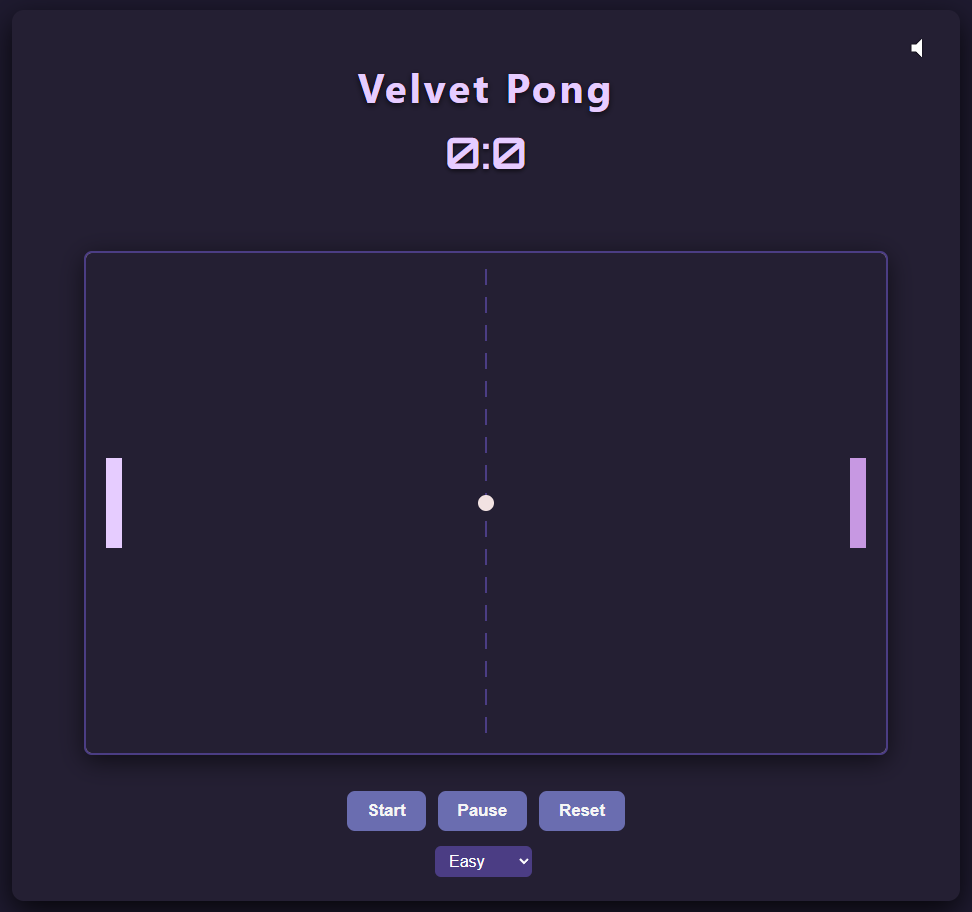

## 🏓 Velvet Pong

An exciting and nostalgic pong game with a modern, velvet-themed twist. This web-based game offers smooth gameplay, adjustable difficulty settings, and a cool, retro aesthetic. Compete against the AI or challenge a friend to a fast-paced game of pong, with dynamic sound effects and smooth animations.

## Project Overview

**Velvet Pong** is a simple yet engaging pong game built with vanilla JavaScript, HTML5, and CSS3. The game features two paddles (player and AI), a bouncing ball, a dynamic scoreboard, and interactive sound effects. Players can adjust the difficulty level (easy, medium, or hard) to make the game more challenging.

## Key Features

* **Two-player mode** with AI opponent.
* **Adjustable difficulty**: easy, medium, and hard.
* **Dynamic Sound Effects** for ball hits, wall bounces, and scores.
* **Responsive Design** optimized for various screen sizes.
* **Countdown timer** before the game starts.
* **Game Controls**: Start, Pause, and Reset buttons.
* **Modern Retro UI** with velvet colors, smooth animations, and a glowing aesthetic.

## How It Works

1. The game features two paddles: one controlled by the player and the other by the AI.
2. The player can move their paddle up or down using the mouse.
3. The ball moves according to a random direction and bounces off walls and paddles.
4. When the ball passes a paddle, the opponent scores a point, and the ball is reset to the center.
5. The game runs until one player reaches 10 points. The winner is displayed with a glowing text message.
6. The player can control the game with buttons for start, pause, and reset.
7. A countdown timer starts before each new game to add suspense and excitement.

## Installation & Setup

### Prerequisites

* Modern web browser (Chrome, Firefox, Edge, Safari)
* Basic knowledge of HTML, CSS, and JavaScript (optional, for customization)

### Getting Started

1. **Clone or download the repository:**

```bash
git clone https://github.com/YourUsername/velvet-pong
cd velvet-pong
```

2. **Open `index.html`** in your preferred browser to start the game.

3. **Customize the game settings** by modifying the constants in `script.js` for paddle size, ball speed, and AI difficulty.

4. (Optional) Replace the game background image or sound files for a personalized experience.

5. Remove the Game image from the assets folder (game.png).

## Customization

* **Adjust Difficulty:**
  Modify the `difficulty` options in the HTML file or `script.js` to change the AI behavior and ball speed.

* **Sound Effects:**
  Add or change sound effects by modifying the audio files in the project or adjusting the `playSound` function in `script.js`.

* **Style Adjustments:**
  Edit the `style.css` file to modify colors, fonts, or animations for the pong paddles, ball, and background.

* **Background Image:**
  Update the `.background-blur` selector in `style.css` for a custom background image.

## Folder Structure

```
velvet-pong/
├── assets/
│   ├── icon.webp
│   └── background.jpg  (optional)
├── index.html
├── style.css
└── script.js
```

## Technologies Used

* **HTML5** for semantic markup and structure.
* **CSS3** with Flexbox, animations, and custom properties for styling.
* **Vanilla JavaScript** for the game logic, score tracking, and AI opponent behavior.
* Responsive design principles for a consistent experience across all devices.
* Google Fonts (Orbitron) for the modern, retro typography.

## Contribution Guidelines

Contributions are always welcome! To help improve this project:

* Fork the repository and create your feature branch (`git checkout -b feature/your-feature`).
* Commit your changes with a clear message (`git commit -m "Add feature XYZ"`).
* Push to your branch (`git push origin feature/your-feature`).
* Open a Pull Request to merge your improvements.

Please ensure the code is clean, well-documented, and tested before submitting.

## License

This project is licensed under the **MIT License**.
See the [LICENSE](./LICENSE) file for full details.

## Author

Created and maintained by **KaloudasDev**.
If you find this project useful or fun, feel free to give it a ⭐️ on GitHub!

## Useful Links

* [Email Account](mailto:kaloudasdev@gmail.com)
* [Discord Account](https://discordapp.com/users/1069279857072160921)
* [GitHub Repository](https://github.com/KaloudasDev/velvet-pong)
* [License Information](https://en.wikipedia.org/wiki/MIT_License)  

<br>


